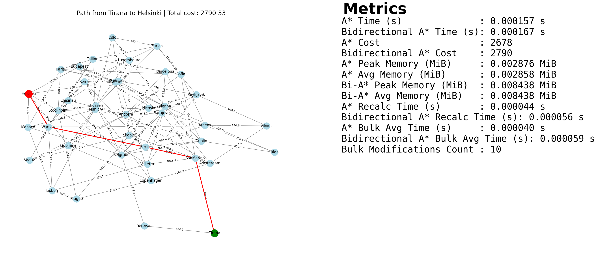
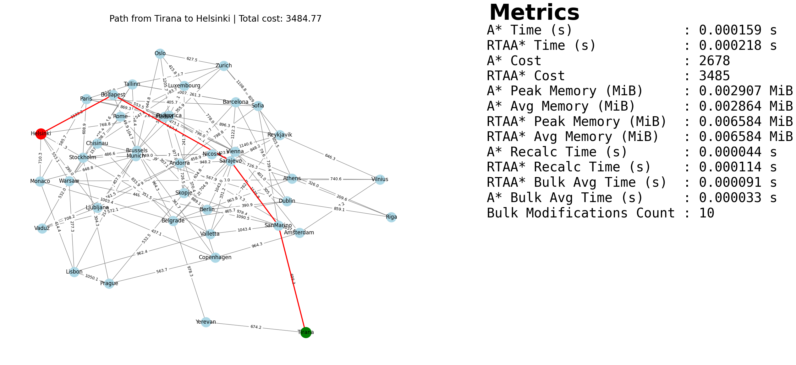
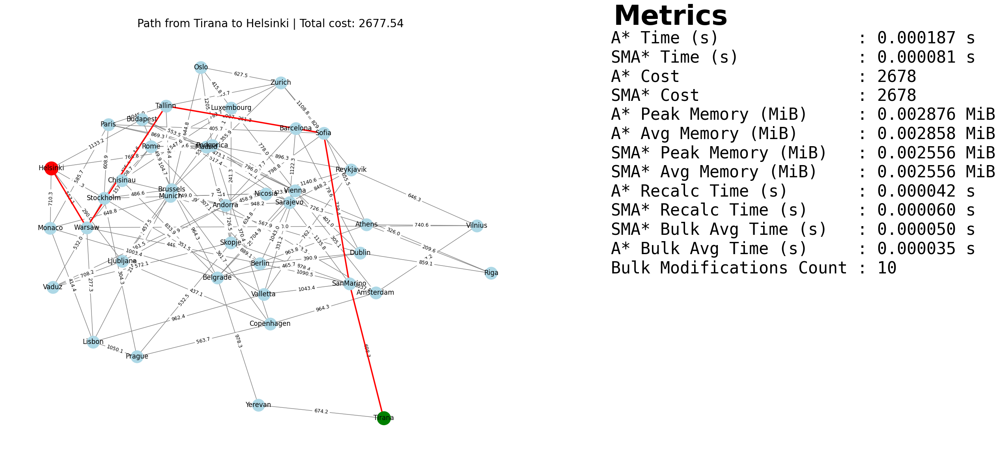
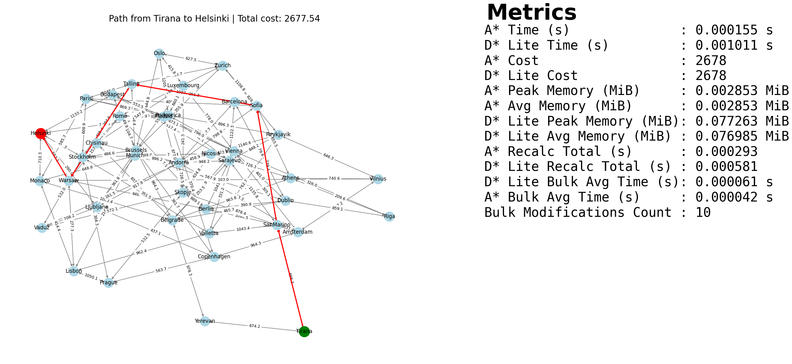

# Path Planning Algorithms using NetworkX

## Overview

NetworkX is a free Python library for graphs and networks and is used in many applications and projects in order to find the shortest path in path planning scenarios. For dense graphs, the library provides the Floyd-Warshall algorithm and the A* ("A-Star") algorithm for shortest paths and path lengths.

However, several extensions have been proposed to improve the A* algorithm that are not provided by the library. In this context, this project presents a set of implementations improving the A* algorithm using the NetworkX library, including: IDA*, D* Lite, SMA*, Bidirectional A* and RTA*.

We first review the literature of the usage and general application of NetworkX in different domains of applicability, and then its usage and exploration in shortest path contexts. By reviewing and validating the usage of these extended A* algorithms implemented in Python using NetworkX, the implementations have been tested and validated in a network environment.

We conducted benchmarking of the standard algorithms versus the extended ones, and concluded that A* extensions provide better efficiency in a tri-objective scenario involving path length, cost, and toll.

To foster further research in this specific field of shortest path problems, the source code of all algorithms is available in this open-source GitHub repository.

---

## Directory Structure

```
.
├── Algorithms              
│   ├── bi_astar.py
│   ├── d_star_lite.py
│   ├── ida_star.py
│   ├── rtaa_star.py
│   └── sma_star.py
│
├── Testers                 
│   ├── bi_astar.py
│   ├── d_star_lite.py
│   ├── ida_star.py
│   ├── rtaa_star.py
│   └── sma_star.py
│
├── Graphs/Plots            
│   └── graphs.py
│
├── Csv                     
│   ├── cities_nodes_special.csv
│   └── cities_nodes_special_original.csv
│
├── main.py                 
└── metrics.xlsx            
```

## Path Planning - Advanced A* Algorithms

## Bidirectional A* Algorithm

<div align="center">
  <div style="border:1px solid #ccc; border-radius:10px; padding:30px; margin:30px; width:95%;">
    <p style="font-size:20px; font-weight:bold;">Bidirectional A*</p>
    
  </div>
</div>

## RTA* Algorithm

<div align="center">
  <div style="border:1px solid #ccc; border-radius:10px; padding:30px; margin:30px; width:95%;">
    <p style="font-size:20px; font-weight:bold;">RTA*</p>
    
  </div>
</div>

## SMA* Algorithm

<div align="center">
  <div style="border:1px solid #ccc; border-radius:10px; padding:30px; margin:30px; width:95%;">
    <p style="font-size:20px; font-weight:bold;">SMA*</p>
    
  </div>
</div>

## IDA* Algorithm

<div align="center">
  <div style="border:1px solid #ccc; border-radius:10px; padding:30px; margin:30px; width:95%;">
    <p style="font-size:20px; font-weight:bold;">IDA*</p>
    
  </div>
</div>

## D* Lite Algorithm

<div align="center">
  <div style="border:1px solid #ccc; border-radius:10px; padding:30px; margin:30px; width:95%;">
    <p style="font-size:20px; font-weight:bold;">D* Lite</p>
    
  </div>
</div>

---

## Installation

### 1. Clone the repository

```bash
git clone https://github.com/migcruzz/Testing_NetworkX_Algorithms.git
```

### 2. Create and activate a virtual environment (optional but recommended)

```bash
python -m venv venv
source venv/bin/activate  
```

### 3. Install the dependencies

```bash
pip install -r requirements.txt
```

---

## Running the Project

Make sure the configuration in `config.py` is properly set (e.g., source and target nodes, memory limits, etc.), and then run:

```bash
python main.py
```

This will:
- Run all algorithm comparisons in parallel
- Generate graph images showing paths found by each algorithm
- Write performance metrics to an Excel file (`metrics.xlsx`)

---


